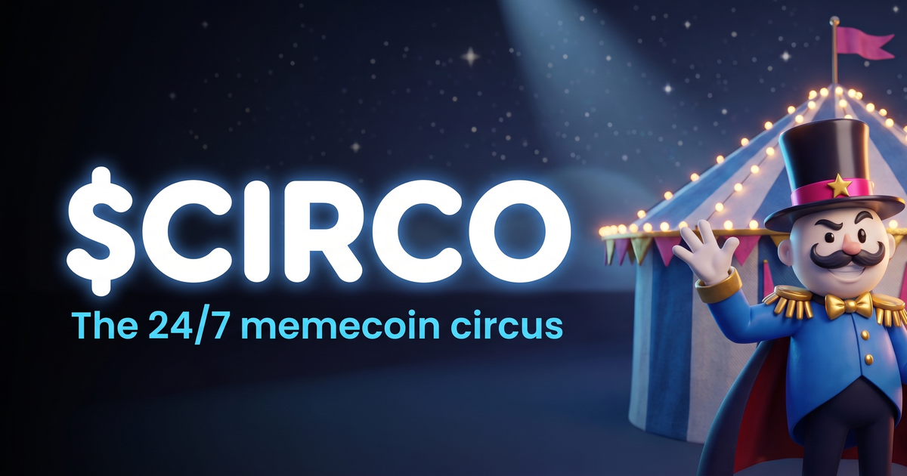
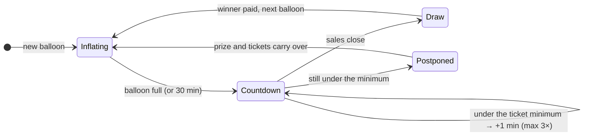
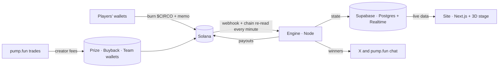

<p align="center">
  
</p>

<h1 align="center">$CIRCO · The 24/7 memecoin circus</h1>

<p align="center">
  Every trade pumps the balloon. Every ticket burns $CIRCO. When it pops, someone wins.
</p>

<p align="center">
  <a href="docs/story.md">The story</a> ·
  <a href="docs/how-it-works.md">How it works</a> ·
  <a href="docs/fairness.md">Provably fair</a> ·
  <a href="docs/architecture.md">Architecture</a> ·
  <a href="docs/security.md">Security</a> ·
  <a href="docs/rehearsal.md">Rehearsal report</a> ·
  <a href="docs/journey.md">The journey</a>
</p>

---

## What is $CIRCO

$CIRCO is a memecoin on Solana, launched on pump.fun, with a game built into its fees.

Every $CIRCO trade generates creator fees. Part of them flows into a **live 3D balloon** on the site. When the balloon is full, a countdown starts; holders burn $CIRCO to get **tickets**; the balloon pops and a **wheel picks the winner**, who is paid in SOL automatically. Then a new balloon appears. Around the clock.

The Ringmaster, a vinyl-toy circus host, runs the show: he comments every round, greets the winner by name, and takes the occasional tomato to the face.

| | |
| --- | --- |
| **Chain** | Solana |
| **Launch** | pump.fun, creator fee sharing locked at launch |
| **Contract address** | announced at launch, only by the official X account and the site. Anything before that is fake. |
| **Site** | announced at launch |

## A round in 30 seconds



## Where the fees go

| Share | Destination |
| ---: | --- |
| **45%** | Prize wallet: fills the balloons (5% of it builds the Mega Jackpot) |
| **45%** | Automatic buyback of $CIRCO, then burned |
| **10%** | Team: servers, development, running costs |

Tickets are paid by **burning** $CIRCO (10,000 per ticket at launch). Buybacks burn more. The supply only goes one way.

## The balloons

| Balloon | Prize | Share of rounds | Ticket minimum |
| --- | ---: | ---: | ---: |
| Green balloon dog | 0.5 SOL | 40% | 50 |
| Blue balloon | 1 SOL | 35% | 100 |
| Red rocket | 2 SOL | 20% | 150 |
| Gold trophy | 5 SOL | 5% | 300 |

95% of the prize goes to the winner, 5% to whoever bought the last ticket before sales closed. At least one gold trophy every day.

## Around the balloon

- **Mega Jackpot**: every draw has a small chance to be a Mega Pop, paying the jackpot on top.
- **Shooting gallery**: burn $CIRCO for three shots at the balloons; every pop is a ticket.
- **Guess the next balloon**: a right guess pays tickets for the next round.
- **Stage effects**: fireworks, confetti, an air horn, a tomato for the Ringmaster, seen live by everyone.
- **Clowns vs Acrobats**: pick a team; the team that burns more each week earns bonus tickets.
- **Live chat** shared with the coin's pump.fun chat.

Full rules: [docs/how-it-works.md](docs/how-it-works.md).

## Provably fair

Nobody, including the team, can choose or predict the winner.

1. When a round starts, the engine publishes `sha256(secret)`.
2. When sales close, it mixes the secret with the **Solana blockhash** of the closing slot, which nobody knows in advance.
3. After the draw it reveals the secret. Anyone can recompute the winner, the Mega Pop and the next balloon:

```bash
node scripts/verify-round.mjs <round>
```

Details and the exact maths: [docs/fairness.md](docs/fairness.md).

## How it is built



| Folder | What it does |
| --- | --- |
| [`engine`](engine) | The only process that writes game state and moves prize SOL. Rules, draws, payouts, buybacks. |
| [`web`](web) | The site: wallet connect, ticket burns, chat, win pages. The 3D stage lives in `web/public/stage`. |
| [`supabase/migrations`](supabase/migrations) | Database schema. Public read, engine-only write. |
| [`scripts`](scripts) | Wallet creation, Helius webhook, round verification, the rehearsal kit. |
| [`docs`](docs) | Everything written down. |

More: [docs/architecture.md](docs/architecture.md).

## Tested before launch

The whole system was rehearsed on a local Solana chain: the real engine and the real site, with bots buying tickets, playing, guessing and launching effects, real test-SOL payouts, and the engine killed in the middle of a draw (every payout still landed exactly once). The rehearsal found four bugs; all were fixed before launch. Full report: [docs/rehearsal.md](docs/rehearsal.md).

```bash
cd engine && npm install && npm test     # game rules: 20 tests
```

## Running it yourself

See [docs/operations.md](docs/operations.md) for setup, environment variables, deployment and running costs.

## Risks

$CIRCO is a memecoin. Its price can go to zero. Tokens spent on tickets are burned and cannot be recovered. Nothing here is financial advice. Only play with money you can afford to lose, and check the rules of your country before playing.

## License

Code: [MIT](LICENSE). The $CIRCO name, the Ringmaster and the artwork are the project's brand and are not covered by the code license.
