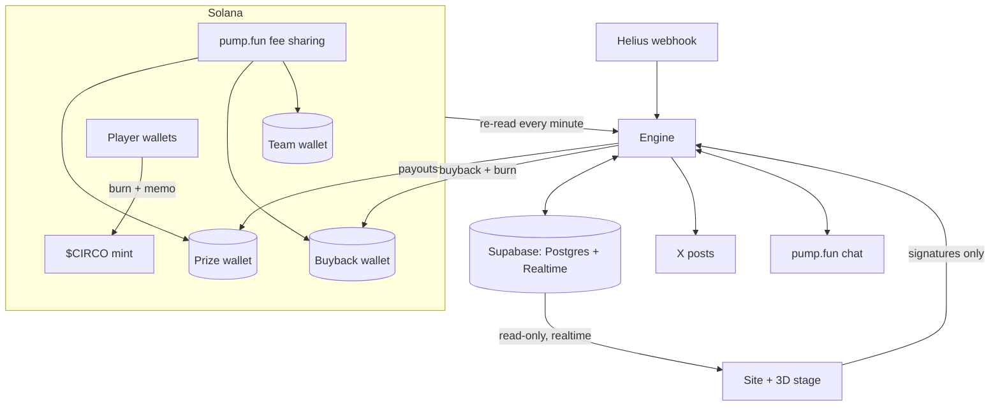

# Architecture

Four moving parts, one rule: **only the engine writes game state and moves prize SOL.**

## Components

| Component | Tech | Role |
| --- | --- | --- |
| **Engine** | Node 22, TypeScript (run with type stripping, no build step) | Round state machine, ticket verification, draws, payouts, fee distribution, buybacks, snapshots, the pump.fun chat bridge, X posts. |
| **Database** | Supabase (Postgres, Realtime, row-level security) | Rounds, tickets, fees, payouts, chat, games, profiles, settings. The public can read; only the engine's service key can write. |
| **Site** | Next.js on Vercel | Wallet connect, builds burn transactions for the player to sign, forwards signatures to the engine, win pages with share images, team panel. |
| **Stage** | Three.js in a single HTML file | The 3D show. Receives live data from the site through `postMessage`; never talks to the chain or the database directly. |

## Life of a ticket

1. The site builds one transaction: burn `tickets × price` $CIRCO plus the memo `CIRCO:<round>:<tickets>`.
2. The player signs it in their wallet. The site sends **only the signature** to the engine.
3. The engine reads the transaction on-chain and checks mint, amount, signer, memo and the round, then records the tickets through a database function that enforces the 10-ticket cap under a lock.
4. The same burn reaches the engine two more ways: the Helius webhook, and a re-read of the mint's recent transactions every minute. Every write is keyed by the transaction signature, so a burn counts once however many times it is seen. Closing the browser loses nothing.

## Safety properties

| Property | How |
| --- | --- |
| **Never paid twice** | Payouts are written to the database *before* they are sent; before any resend the engine looks for the transaction on-chain. Verified by killing the engine mid-draw during the rehearsal. |
| **Draws survive restarts** | The winner is stored once; a restarted engine resumes the draw where it stopped. |
| **Nothing burned is lost** | Tickets above the cap, or burns landing after sales close, become credits for the next rounds. |
| **Missed events are recovered** | Every minute the engine re-reads the prize wallet and the mint; anything the webhook missed is counted. |
| **No blockhash shopping** | The draw uses the first finalized block at least 2 s after sales close, a rule anyone can check, so the engine cannot wait for a blockhash it likes. |
| **Fair ordering** | The last-ticket bonus follows the slot each burn landed in on-chain, not the order the engine saw them. |
| **Top-ups are not fees** | SOL sent to the prize wallet by the team (for example the network-fee reserve) is never counted as prize. |
| **A reserve for fees** | 0.01 SOL always stays in the prize wallet to pay network fees. |
| **Settings stay sane** | Every setting the team can change has a server-side range check. |

## Money flow

- **Creator fees** accumulate in pump.fun; the engine runs the permissionless distribution every 30 seconds with the official SDK, and the shares land directly in the three wallets.
- **Prize wallet**: fills the balloons and the Mega Jackpot, pays winners.
- **Buyback wallet**: buys dips as a three-step ladder sized to the chart's own volatility, waiting for the fall to stop before each step; gives gentle, rate-limited support to quiet charts; drips out anything above 10 SOL or older than 24 hours over several hours. Buys are split into uneven chunks at random times, each capped at 2% price impact, and everything bought is burned. Design, stress test and results: [buyback.md](buyback.md).
- **Team wallet**: receives its 10% and nothing else touches it.

## Database

Migrations in [`supabase/migrations`](../supabase/migrations), applied in order:

| Migration | Adds |
| --- | --- |
| `0001_init` | Rounds, tickets, fees, trades, chat, buybacks, settings, leaderboards |
| `0002_secrets_and_summary` | Secrets kept apart from public tables, public summary |
| `0003_engine_safety` | Processed burns, credits, idempotent payouts, snapshots |
| `0004_games` | Shooting gallery |
| `0005_profiles`, `0006_x_link` | Nicknames, linked X accounts |
| `0007_show_features` | Mega Jackpot, stage effects, teams, next-balloon guesses |
| `0008_pumpfun_chat` | Messages relayed from the pump.fun chat |
| `0009_burn_order` | On-chain slot of each burn |
| `0010_smart_buyback` | Price samples, buyback reasons, green opening rounds |
| `0011_lucky_meter_and_gala` | Lucky meter, graduation gala |
| `0012_engine_state` | Buyback state that survives restarts, timer minimum fill |
| `0013_hot_mode` | Express countdowns and supercharged balloons |
